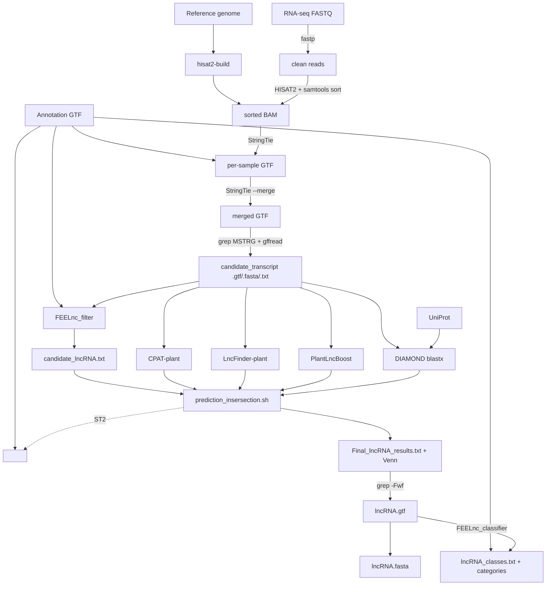

# IWGC lncRNA Prediction Pipeline

A **faithful, containerized re-implementation of the
[Plant-LncRNA-pipeline-v2](https://github.com/xuechantian/Plant-LncRNA-pipeline-v2)**
(Tian *et al.*) for discovering long non-coding RNAs (lncRNAs) in plants.

Every step runs the **same tool, command, model and cutoff as the upstream pipeline** — the
only differences are that each tool runs inside its own **Singularity/Apptainer** container and
the whole thing is orchestrated by **Snakemake**. Documented deviations from upstream are listed
in [Fidelity to upstream](#fidelity-to-upstream); there are only three, all cosmetic/packaging.

> Upstream: Tian, X.-C. *et al.* *PlantLncBoost…* New Phytol. (2025),
> [DOI](https://doi.org/10.1111/nph.70211) ·
> [Plant-LncRNA-pipeline-v2](https://github.com/xuechantian/Plant-LncRNA-pipeline-v2) ·
> [FEELnc](https://github.com/tderrien/FEELnc).

---

## Table of contents
- [Overview](#overview)
- [Workflow](#workflow)
- [Inputs](#inputs)
- [Pipeline steps](#pipeline-steps)
- [Containers](#containers)
- [Outputs](#outputs)
- [How to run](#how-to-run)
- [Fidelity to upstream](#fidelity-to-upstream)
- [Test results (Arabidopsis TAIR10)](#test-results-arabidopsis-tair10)
- [Repository layout](#repository-layout)

---

## Overview

| | |
|---|---|
| **Goal** | High-confidence lncRNAs not in a species' current annotation |
| **Method** | Reference-guided assembly → 4-tool coding-potential consensus |
| **Consensus** | `PlantLncBoost ∩ CPAT ∩ LncFinder ∩ (FEELnc candidates − DIAMOND protein hits)` |
| **Engine** | Snakemake 9 + Apptainer (one image per tool) |
| **Tested on** | MSU HPCC (ICER), Arabidopsis TAIR10 → 10 lncRNAs end-to-end |

---

## Workflow



For a 2-sample run the Snakefile expands to **20 jobs**.

---

## Inputs

Configured in `config/config.yaml` (`{species}`/`{prefix}` templating).

| Input | Config key | Notes |
|-------|-----------|-------|
| Reference genome | `reference_fasta` | cleaned chromosome FASTA |
| Annotation | `annotation_gtf` | protein-coding GTF (`gene_id`/`transcript_id`) |
| RNA-seq | `sra_accessions` / `raw_fastq_dir` | SRA accessions to fetch, or existing FASTQ |
| Protein DB | `diamond_db` / `uniprot_fasta` | DIAMOND db, or SwissProt FASTA to build one |
| Strandness | `strand_specific` | `true` adds `--rna-strandness RF` / stringtie `--rf` |

Reference prep (NCBI `datasets` → `scripts/ncbi_datasets_cleanup.py`) produces
`{species}.chromosomes.fa` + `{species}_mRNA.gtf`. The CPAT logit, hexamer, PlantLncBoost model,
LncFinder plant model + training data, and the intersection script are all bundled inside the
containers (or this repo) — no external model downloads needed.

---

## Pipeline steps

| # | Rule | Tool | Container | Upstream step |
|---|------|------|-----------|---------------|
| 1 | `prefetch_sra` *(opt)* | prefetch/fasterq-dump | `sra_tools` | 5.1 |
| 2 | `fastp` | fastp | `fastp` | 5.2 |
| 3 | `hisat2_index` | hisat2-build | `hisat2` | 6 |
| 4 | `hisat2_align` | hisat2 \| samtools sort | `hisat2` | 6 |
| 5 | `stringtie_assemble` | StringTie | `stringtie` | 7 |
| 6 | `stringtie_merge` | StringTie --merge | `stringtie` | 7 |
| 7 | `extract_candidates` | grep MSTRG + gffread | `gffread` | 7 |
| 8 | `feelnc_filter` | FEELnc_filter.pl | `feelnc` | 8.1 |
| 9 | `lncboost` | PlantLncBoost | `lncboost` | 8.2 |
| 10 | `lncfinder` | LncFinder-plant (R) | `lncfinder` | 8.3 |
| 11 | `cpat` | CPAT-plant | `cpat` | 8.4 |
| 12 | `diamond_makedb`/`diamond_blastx` | DIAMOND | `diamond` | 8.5 |
| 13 | `intersect_predictions` | prediction_insersection.sh | `intersect` | 8.6 |
| 14 | `final_lncRNA_gtf` | grep -Fwf | `gffread` | 8.6 |
| 15 | `final_lncRNA_fasta` | gffread | `gffread` | (convenience) |
| 16 | `feelnc_classifier` | FEELnc_classifier.pl + awk | `feelnc` | 9 |

**Consensus (step 13):** the upstream `prediction_insersection.sh` is run verbatim — a candidate
is kept iff it is PlantLncBoost-lncRNA **and** CPAT-noncoding **and** LncFinder-noncoding **and**
in the FEELnc candidate list **and** has no DIAMOND hit (`pident>60 & evalue<1e-5`).

---

## Containers

The pipeline runs **one tool per Singularity/Apptainer container** (for reproducibility): 15 images
defined by `containers/*.def`, built with `scripts/build_singularity_images.sh` into
`containers/images/` (not stored in git, ~3.5 GB). Per-image details in
[docs/CONTAINERS.md](docs/CONTAINERS.md).

### Containers created / rebuilt for this faithful re-implementation

**Three** images were built specifically so the containerized pipeline matches
Plant-LncRNA-pipeline-v2; the rest were reused as-is.

| Image | Status | Why it was created |
|-------|--------|--------------------|
| **`hisat2.sif`** | **new** | Upstream aligns with **HISAT2** (not STAR) and no HISAT2 image existed. Built with HISAT2 2.2.1 **+ samtools** so the rule pipes `hisat2 … \| samtools sort` straight into a sorted BAM. |
| **`lncfinder.sif`** | **rebuilt** | To run **LncFinder-plant exactly as upstream**: bundles the plant SVM (`Plant_model.rda`) and the training FASTAs from the author's predecessor repo (`Plant-LncRNA-pipline`) and uses `SS.features=FALSE`. The earlier image used the generic *wheat* model with secondary-structure features (ViennaRNA was dropped). |
| **`intersect_ids.sif`** | **rebuilt** | To run the upstream `prediction_insersection.sh` **verbatim**: rebuilt on `rocker/tidyverse` + `VennDiagram`. The earlier image was base-R only and could not run that script. |

(`star.sif` from the earlier STAR-based version is **retired** — replaced by `hisat2`.)

### Full container set

| Image | Tool(s) |
|-------|---------|
| `hisat2` *(new)* | HISAT2 2.2.1 + samtools 1.20 |
| `lncfinder` *(rebuilt)* | R + LncFinder + plant SVM & training data |
| `intersect_ids` *(rebuilt)* | R + tidyverse + VennDiagram + upstream intersection script |
| `fastp` | fastp 0.23.4 |
| `stringtie` | StringTie 2.2.1 |
| `gffread` | gffread 0.12.9 |
| `feelnc` | FEELnc (+ BioPerl) |
| `cpat_plant` | CPAT 1.2.4 + Plant hexamer/logit model |
| `plant_lnc_boost` | PlantLncBoost (CatBoost) + model |
| `diamond` | DIAMOND 2.1.8 |
| `sra_tools` | sra-tools 3.1.1 + pigz |
| `samtools` | samtools 1.20 |
| `minimap2` | minimap2 2.28 *(benchmarking)* |
| `cd_hit` | cd-hit 4.8.1 *(benchmarking)* |
| `python_utils` | Python 3 |

---

## Outputs

`{species}/03_outputs/10_final/`:

| File | Description |
|------|-------------|
| `Final_lncRNA_results.txt` | high-confidence lncRNA IDs (upstream name) |
| `lncRNA.gtf` / `lncRNA.fasta` | their GTF and sequences |
| `lncRNA_classes.txt` | FEELnc classification |
| `LncRNA_{antisense_exonic,intronic,upstream,downstream,intergenic,Bidirectional}.txt` | category breakdown (upstream §9) |
| `Venn_pred_lncRNA.pdf` | 4-tool overlap Venn |

---

## How to run

```bash
conda env create -f workflow/envs/snakemake.yaml && conda activate iwgc-lnc-snakemake
scripts/build_singularity_images.sh                 # build the 15 images (needs internet)
# edit config/config.yaml for your species
snakemake --snakefile workflow/Snakefile --configfile config/config.yaml --cores 32 --dry-run
snakemake --snakefile workflow/Snakefile --configfile config/config.yaml --cores 32 --use-singularity
```

On Slurm, wrap the `snakemake` call in `sbatch` (see `scripts/run_pipeline_ath.sb`): put the
`apptainer` binary on `PATH` and bind the project tree via `APPTAINER_BINDPATH`.

To reproduce the upstream README's **Glycine max example** (Phytozome Wm82.a6.v1 + the
`SRR1174*` runs) end-to-end on HPC, follow
[docs/RUNNING_GMAX_EXAMPLE.md](docs/RUNNING_GMAX_EXAMPLE.md) (ready-made `config/config.gmax.yaml`, `scripts/run_pipeline_gmax.sb`, and a FASTQ download helper).

---

## Fidelity to upstream

The pipeline reproduces Plant-LncRNA-pipeline-v2 command-for-command. There are **three
documented deviations, none of which change the method**:

1. **CPAT logit format.** Upstream `Plant.logit.RData` is serialized in the newer RDX3 format,
   which CPAT 1.2.4's R 3.4 cannot `load()`. `scripts/Plant.logit.v2.RData` is the **byte-identical
   model** (`all.equal == TRUE`) re-saved in the R-v2 format. Same model, same scores.
2. **LncFinder training data.** The v2 README's `make_frequencies()` reads
   `data/training/{mRNA,lncRNA}.fasta`, which are not shipped in the v2 repo; they live in the
   author's predecessor repo (`Plant-LncRNA-pipline/example_data/`). The `lncfinder` container
   clones that repo, so the plant model is reproduced exactly.
3. **Venn diagram.** `prediction_insersection.sh` is vendored verbatim except the cosmetic
   `venn.diagram()` call gets `filename=NULL` + `grid.draw()` (newer VennDiagram requires it).
   The lncRNA intersection logic is untouched.

**Known upstream quirk (reproduced, not fixed):** CPAT's output has an unnamed first column, so
`prediction_insersection.sh`'s `read_delim(...) %>% filter(coding_prob<0.46)` parses raggedly and
matches all candidates — i.e. **CPAT effectively does not filter** under current tidyverse. The
consensus is therefore driven by FEELnc ∩ PlantLncBoost ∩ LncFinder ∩ ¬protein. This is the
published script's behavior; it is kept verbatim by design.

---

## Test results

End-to-end validation on the MSU HPCC — full report in
[docs/TEST_RESULTS.md](docs/TEST_RESULTS.md).

**Arabidopsis thaliana (TAIR10)** — small smoke test
([outputs](docs/test_results/arabidopsis_tair10/)):
- Inputs: TAIR10 (RefSeq `GCF_000001735.4`); `SRR2073143` + `SRR1688325` (6 M reads each).
- Funnel: 2,674 candidates → FEELnc 14 · LncFinder 585 · PlantLncBoost 593 → **10 lncRNAs**.

**Glycine max (Phytozome Wm82.a6.v1)** — the upstream README's own example
([outputs](docs/test_results/gmax_wm82/), guide: [RUNNING_GMAX_EXAMPLE.md](docs/RUNNING_GMAX_EXAMPLE.md)):
- Inputs: Wm82.a6.v1 genome + `SRR1174214/17/18/32` (paired-end, RF-stranded).
- Funnel: 75,327 candidates → FEELnc 53,515 · LncFinder 62,564 · PlantLncBoost 62,194 → **23,606 lncRNAs**.
- Larger because of 4 deep stranded libraries + the upstream CPAT-non-filtering quirk (kept verbatim).

> **How to read these counts** (why g.max is an over-estimate vs PLncDB/literature, the upstream
> CPAT parsing analysis, and next steps): [docs/RESULTS_INTERPRETATION.md](docs/RESULTS_INTERPRETATION.md).

---

## Repository layout

```
config/                config.yaml (template) + config.ath.yaml (Arabidopsis test)
workflow/Snakefile     the pipeline (20 rules)
workflow/scripts/      lncFinder.R, prediction_insersection.sh (vendored), filter_gtf_by_ids.py
containers/*.def       Singularity definitions (built into containers/images/)
scripts/               build script, Slurm templates, ncbi cleanup, Plant.logit.v2.RData
docs/                  CONTAINERS.md, TEST_RESULTS.md, test_results/
{species}/             per-species inputs (01_inputs) + outputs (03_outputs)
```
